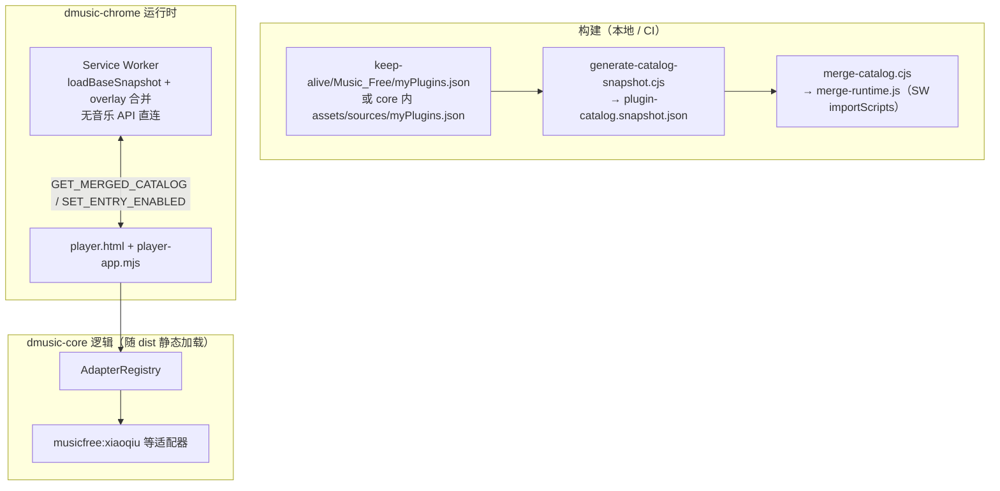

# DMusic Core 架构（新一代最小骨架）

## 定位

- **dmusic-core**：播放器 UI、目录模型、HTTP 客户端与 **音源适配器** 的源码（静态 HTML/CSS/ESM；可后续引入打包工具）。
- **dmusic-chrome**：MV3 `manifest`、**service worker**（目录合并 + `chrome.storage.local` overlay）、**`npm run build`** 将 core 产物同步到 **`dist/`**。

与 OpenSpec 变更 **`openspec/changes/dmusic-chrome-musicfree-player/`** 中的 `musicfree-plugin-catalog`、`player-core-integration`、`chrome-music-extension` 对齐。

## 端到端数据流

要点：

1. **搜播 HTTP 请求** 仅在 **扩展页面（播放器页）上下文** 由 core 适配器发起；SW **不**调用 QQ / 解析服务等音乐 API（见 `dmusic-chrome/scripts/verify-sw-boundary.cjs`）。
2. **内置目录** 来自构建生成的只读快照；**用户态** 仅能通过 overlay 调整 **`enabled`** 等字段，**不**存储可执行脚本字符串。

## 插件目录（Music_Free）

| 概念 | 说明 |
|------|------|
| 源清单 | `assets/sources/myPlugins.json`（与上游 `keep-alive/Music_Free/myPlugins.json` 对齐，可随版本更新） |
| 快照 | `scripts/generate-catalog-snapshot.cjs` → `assets/plugin-catalog.snapshot.json`（**`.gitignore`**，由 `dmusic-chrome` 的 `npm run build` 在拷贝前生成） |
| `stableId` | 由插件脚本 URL **文件名**派生，如 `xiaoqiu.js` → `musicfree:xiaoqiu`（`scripts/derive-stable-id.cjs`，单测覆盖） |
| 目录项字段 | `stableId`、`name`、`version`、`adapterId`、`adapterStatus`（`ready` \| `pending`）、`enabled`、可选 `sourceUrl` |
| `adapterStatus` | 构建阶段：仅对已在本仓库实现 **fetch 适配器** 并注册的 `adapterId` 写 `ready`；其余为 `pending` |

## Storage overlay（Chrome）

- **键名**：`dmusic.catalog.overlay`
- **结构**：`{ byStableId: Record<string, { enabled?: boolean }> }`
- **合并**：`scripts/merge-catalog.cjs`（Node 单测）；构建时生成 `dist/js/plugin-catalog/merge-runtime.js`，供 SW **`importScripts`**，与 Node 合并语义一致。
- **消息**：`GET_MERGED_CATALOG`、`SET_ENTRY_ENABLED`（见 `dmusic-chrome/background.js`）。

## HTTP 与适配器（MVP）

- **`js/http/fetch-http-client.mjs`**：构造注入 `fetch`，单元测试传入 **mock**，避免 CI 访问公网。
- **`js/adapters/registry.mjs`**：`adapterId` → 实现；未 `register` 的 id **`has()` 为 false**。
- **`js/adapters/musicfree-xiaoqiu.mjs`**：搜索 / 解析端点与 `keep-alive/Music_Free/xiaoqiu.js` 对齐；快照中对应条目标为 `ready`。

## 远程 HTTPS 清单（Phase 2 / 可选）

当前 **未实现** `FEATURE_REMOTE_CATALOG` 或运行时拉取远程 JSON；符合 OpenSpec「**远程清单默认关闭**」：合并输入仅为 **内置快照 + storage overlay**。若后续实现，须在 `design.md` 中补充 ADR，并保持 **不执行远程 JS**。

## 测试与 CI（如何验证本变更）

| 范围 | 命令 | 断言内容 |
|------|------|----------|
| core | `cd dmusic-core && npm test` | `merge-catalog`、`derive-stable-id` / `parse-my-plugins`、小秋适配器 **mock** 搜播、`registry` 行为 |
| chrome | `cd dmusic-chrome && npm test` | `dist/manifest.json` 的 MV3 / `service_worker`；**`background.js` 无音乐 API 直连片段**（`verify-sw-boundary`） |
| 集成构建 | `cd dmusic-chrome && npm run build` | 生成快照、写入 `merge-runtime.js`、同步 core 至 `dist/` |

仓库内工作流：`.github/workflows/dmusic-chrome-verify.yml`（先 **dmusic-core** `npm test`，再 **dmusic-chrome** `npm ci` 与 **`npm test`**）。

## 与旧「用户源」模型的关系（设计收口）

本骨架 **不** 恢复 Listen1 时代的「用户粘贴任意 `.js` URL」作为扩展内可执行插件源。MVP 的播放路径仅通过 **`adapterId` + 注册表 + 已实现适配器**；目录中 `pending` 条目在 UI 上明确 **不提供搜播入口**（见 `player-app.mjs`）。若未来需并存旧模型，应单独变更提案与 CSP / 审核评估。
