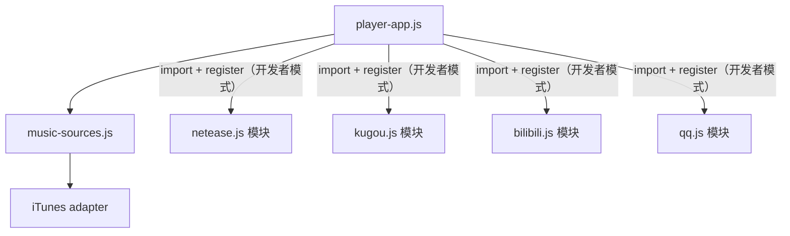

# dmusic 音乐数据源接口说明

本文描述 **dmusic-core**（通用内核）与 **dmusic-chrome**（Chrome 扩展宿主）中的音乐数据源：分层结构、JavaScript 抽象契约、以及各源实际调用的 **HTTP 接口**（URL、方法、参数、响应与本扩展取用字段）。

---

## 1. 分层结构

| 层级 | 文件 | 职责 |
|------|------|------|
| 配置 | [`js/app-config.js`](../js/app-config.js) | `DMUSIC_CONFIG`（如 `searchPageSize`）、`DMUSIC_DEMO_getSearchPageSize()`：统一搜索条数（1–100），须在 `player.html` 中早于依赖它的脚本加载。 |
| UI | [`js/player-app.js`](../js/player-app.js) | 表单、列表、`<audio>` 播放；只依赖 `window.MusicSources` 与各源返回的 `DemoTrack`。 |
| 抽象层 | [`js/music-sources.js`](../js/music-sources.js) | `MusicSources` 注册表：内置仅 iTunes；网易云等与酷狗、Bilibili、QQ 音乐相同，在开发者模式下由 `player-app.js` 通过 `import(chrome.runtime.getURL(…))` 加载包内模块后注册。 |
| 网易云协议与适配 | [`user-sources/netease.js`](../user-sources/netease.js) | 单文件 ES 模块：内含 Cookie / eapi（forge）/ `fetch` 的搜索与播放解析，以及 `MusicSource` 工厂（不再单独维护 `netease-client.js`）。 |
| 酷狗协议与适配 | [`user-sources/kugou.js`](../user-sources/kugou.js) | 单文件 ES 模块：`song_search_v2` 搜索 + `getSongInfo.php?cmd=playInfo` 判断可播与封面、解析直链，与上游 Listen1 `kugou.js` 对齐。 |
| Bilibili 协议与适配 | [`user-sources/bilibili.js`](../user-sources/bilibili.js) | 单文件 ES 模块：视频搜索（`search_type=video`）+ `view` / `playurl` Dash 音频直链；与上游 [`js/provider/bilibili.js`](https://github.com/listen1/listen1_chrome_extension/blob/main/js/provider/bilibili.js) 中 `search` + `bitrack_v_*` 分支对齐（MVP，无 WBI/音频区）。 |
| QQ 音乐协议与适配 | [`user-sources/qq.js`](../user-sources/qq.js) | 单文件 ES 模块：`musicu.fcg` 单曲搜索 + vkey 播放（`M500` 128kbps）；与上游 [`js/provider/qq.js`](https://github.com/listen1/listen1_chrome_extension/blob/main/js/provider/qq.js) 对齐（MVP，无歌单搜索）。 |
| iTunes 网络 | 内联于 `createItunesSource` | 无独立 client 文件，直接 `fetch` Apple Search API。 |



---

## 2. 注册表：`window.MusicSources`

全局挂载于 [`music-sources.js`](../js/music-sources.js) 末尾。

### 2.1 `list(): { id: string, label: string }[]`

| 字段 | 类型 | 说明 |
|------|------|------|
| `id` | `string` | 与 `get(id)`、`DemoTrack.providerId` 一致：内置为 `'itunes'`；其余（含 `'netease'`）为注册用户源 `id`。 |
| `label` | `string` | 人类可读名称，用于填充 `<select>`。 |

**实现说明**：先列出内置源（顺序固定），再按 `id` 字典序追加用户注册项。[`player-app.js`](../js/player-app.js) 在导入/卸载用户源及切换开发者模式后调用 `list()` 刷新选项。

### 2.2 `get(id: string): MusicSource`

| 参数 | 类型 | 说明 |
|------|------|------|
| `id` | `string` | 内置 `'itunes'`，或已通过 `registerUserSource` 注册的用户源 `id`（如 `'netease'`）。 |

| 返回值 | 说明 |
|--------|------|
| `MusicSource` | 见第 3 节对象契约。 |

| 错误 | 说明 |
|------|------|
| `throw new Error('未知音乐源: …')` | `id` 不在注册表中时抛出。 |

### 2.3 开发者模式与用户源 API

以下 API 仅在 **页面「开发者模式」开启**（`localStorage` 键 `dmusic_dev_mode === '1'`）时允许注册用户源；关闭开发者模式时（`setDeveloperMode(false)`，见 **2.3.3**）会清空所有用户注册项。

| 成员 | 签名 | 说明 |
|------|------|------|
| `isDeveloperMode` | `(): boolean` | 是否开启开发者模式。 |
| `setDeveloperMode` | `(enabled: boolean): void` | 写入/清除上述 `localStorage`；`false` 时同时 `clearUserSources`。 |
| `getPluginDeps` | `(): { fetch, log }` | 注入给用户脚本的**白名单**依赖：`fetch` 为绑定后的全局 `fetch`；`log` 为带 `[DemoUserSource]` 前缀的 `console.log`。 |
| `registerUserSource` | `(meta, impl): void` | 注册用户实现。`id` 须匹配 `^[a-z][a-z0-9_-]{0,31}$` 且不得为内置 `itunes`；`label` 非空；`impl.providerId` 必须等于 `meta.id`。未开启开发者模式时抛错。 |
| `registerUserSourceFromGlobal` | `(meta, implOrFactory): void` | 与 `registerUserSource` 相同校验；若第二参为函数，则先调用 `implOrFactory(getPluginDeps())` 得到 `impl`。供「全局注册脚本」路径使用。 |
| `unregisterUserSource` | `(id: string): void` | 仅删除用户表项；内置 `itunes` 抛错。 |
| `clearUserSources` | `(): void` | 清空全部用户注册项（内部由 `setDeveloperMode(false)` 调用）。 |
| `isUserRegistered` | `(id: string): boolean` | 当前 `id` 是否为用户源（非内置）。 |

#### 2.3.1 用户脚本的加载方式（[`player-app.js`](../js/player-app.js)）

Chrome **MV3 扩展页** 的 CSP **不允许**在 `script-src` 中使用 `blob:`（也无法通过 manifest 合法声明），因此 **不能** 使用「本地任意文件 / 粘贴源码 → Blob URL → `import()`」加载用户模块。

本扩展使用 **扩展包内 ES 模块** + **`import(chrome.runtime.getURL(relativePath))`**（`relativePath` 相对扩展根目录，如 `user-sources/kugou.js`）：

1. 脚本须为 `export default function (deps) { return MusicSource }`，并放入 [`user-sources/`](../user-sources/) 目录。
2. 在 [`js/player-app.js`](../js/player-app.js) 的 **`PACKAGED_USER_SOURCES`** 中登记 `{ path, label }`。
3. 在 `chrome://extensions` **重新加载**扩展后，于播放器「开发者模式」下从下拉选择模块并点击 **加载选中模块**。

包内模块仍可调用 `MusicSources.registerUserSourceFromGlobal`（例如拆分为多源注册）；`registerUserSourceFromGlobal` 亦保留供程序化注册使用。

**存储**：本阶段**不**将用户脚本正文写入 `chrome.storage`；刷新页面后需重新导入。用户源的 `id`/`label` 仅在当前会话内存中保留。

#### 2.3.2 安全与 MV3 说明

- 用户脚本与 dmusic 播放器页**同源**执行，**不**存在浏览器级沙箱隔离；脚本在效果上可滥用扩展已授予的能力（例如已声明的 `host_permissions` 下的 `fetch`、以及页面可用的 `chrome.*` API）。**请勿加载不信任源码**；本功能面向本地调试。
- 脚本发起的 `fetch` / `<audio>` 等媒体请求，**仍受 [`manifest.json`](../../dmusic-chrome/manifest.json) 的 `host_permissions` 约束**；若需访问新域名，须修改 manifest 并重新加载扩展。
- 本扩展**不提供**从任意远程 URL `import()` 用户脚本的能力（供应链 / SSRF 风险）。

#### 2.3.3 `setDeveloperMode(enabled: boolean): void`

| `enabled` | 行为 |
|-----------|------|
| `true` | 设置 `dmusic_dev_mode` 为 `'1'`。 |
| `false` | 移除该键，并清空所有用户注册源。 |

---

## 3. `MusicSource` 契约（抽象层）

每个数据源返回的对象须实现下表方法（与代码一致）。**可选**方法由 UI 用 `typeof fn === 'function'` 探测。

| 成员 | 入参 | 返回值 / Promise | 必选 | 说明 |
|------|------|-------------------|------|------|
| `providerId` | — | `string` | 是 | 与 `MusicSources.get` 的 `id` 相同（内置或用户注册 `meta.id`）。 |
| `search` | `keyword: string` | `Promise<DemoTrack[]>` | 是 | 搜索关键词，返回统一曲目列表。 |
| `summarizeSearch` | `tracks: DemoTrack[]` | `string` | 是 | 有结果时用于顶部提示文案。 |
| `isSearchSummaryError` | `tracks: DemoTrack[]` | `boolean` | 否 | 若为 `true`，UI 以错误样式展示 `summarizeSearch` 文案（如 iTunes 全无 `previewUrl`）。 |
| `canAttemptPlay` | `track: DemoTrack` | `boolean` | 是 | 是否允许进入解析 URL / 播放流程。 |
| `reasonBlocked` | `track: DemoTrack` | `string` | 是 | 当 `canAttemptPlay` 为 `false` 时展示的提示；当前实现恒为字符串（若将来改为 `null`，需同步改 [`player-app.js`](../js/player-app.js)）。 |
| `beforeResolveUrl` | `track: DemoTrack` | `string \| null` | 是 | 解析播放地址前的状态文案；网易云返回加载中文案，iTunes 返回 `null`。 |
| `resolveMediaUrl` | `track: DemoTrack` | `Promise<string \| null>` | 是 | 可交给 `<audio src>` 的媒体 URL；失败或无地址时为 `null`。 |
| `nowPlayingLabel` | `track: DemoTrack` | `string` | 是 | 底部「正在播放」前缀标签（纯文本，由 UI 做 HTML 转义）。 |

---

## 4. `DemoTrack` 与 `_native`

与 [`music-sources.js`](../js/music-sources.js) 中 JSDoc `DemoTrack` 一致。

### 4.1 公共字段

| 字段 | 类型 | 说明 |
|------|------|------|
| `providerId` | `string` | 与当前 `MusicSource.providerId` / `MusicSources.get` 的 id 一致（内置或用户源）。 |
| `id` | `string` | 列表内唯一；内置为 `itunes:${trackId}`；网易云为 `ne:${songId}`；酷狗为 `kugou:${fileHash}`；Bilibili 为 `bilibili:${bvid}`；QQ 为 `qq:${songmid}`；用户源建议 `${providerId}:…` 前缀以防碰撞。 |
| `title` | `string` | 曲名。 |
| `artist` | `string` | 艺人（iTunes 用 `artistName`；网易云用首艺人；酷狗用 `SingerName`，数组取首项、`、` 分隔取首段）。 |
| `album` | `string` | 专辑名。 |
| `img` | `string` | 封面 URL，可为空字符串。 |
| `playable` | `boolean` | 是否允许点击后走 `resolveMediaUrl`（与 `canAttemptPlay` 语义对齐）。 |
| `subtitleNote` | `string` | 列表副标题追加；网易云无权限时为 `无版权/试听`；酷狗无直链时为 `无播放地址`；QQ 不可播时为 `无版权或不可播`；否则可为 `''`。 |
| `_native` | `object` | **仅**供当前源的 `resolveMediaUrl` 使用，UI 不应依赖其结构做分支。 |

### 4.2 iTunes：` _native`

```ts
{ previewUrl: string }  // 无试听时为空字符串 ''
```

- `playable === Boolean(previewUrl)`。

### 4.3 网易云：` _native`

```ts
{ neSongId: number }  // 单曲数字 id
```

- `playable` 由 `netease.js` 内 `searchSongs` 根据 `fee` 计算（见第 6 节）。

### 4.4 酷狗：` _native`

```ts
{ fileHash: string; albumId?: string }
```

- `fileHash`：酷狗单曲文件哈希，搜索列表与 `playInfo`、解析播放 URL 共用。
- `playable`：搜索阶段对每条结果并发请求 `playInfo`（见 **5.3.2**），若返回 JSON 中 `url` 为非空字符串则为 `true`。
- `albumId`：可选，来自 `AlbumID` / `album_id`，当前播放解析未使用，预留。

### 4.5 Bilibili：` _native`

```ts
{ bvid: string; cid?: number }
```

- `bvid`：稿件 BV 号；搜索阶段仅写 `bvid`（默认解析时使用 `view` 返回的 **第一 P** 的 `cid`）。
- `cid`：可选；若将来由列表传入多 P 分集，可写 `cid` 以覆盖首 P（与主工程 `bitrack_v_${bvid}-${cid}` 语义一致）。
- `playable`：有有效 `bvid` 时为 `true`（允许尝试解析；实际能否播取决于 `playurl` 是否返回 Dash 音频）。

### 4.6 QQ 音乐：` _native`

```ts
{ songmid: string }
```

- `songmid`：QQ 单曲 mid，搜索与 vkey 播放共用。
- `playable`：列表项存在 `switch` 字段时按主工程 `qq_is_playable` 位运算判断；**无 `switch` 时保守为 `false`**（避免误点）。

---

## 5. 各数据源：对外 HTTP + 适配语义

### 5.1 iTunes（Apple iTunes Search API）

实现参考：[`music-sources.js`](../js/music-sources.js) 中 `createItunesSource().search`。

#### 5.1.1 请求

| 项目 | 值 |
|------|-----|
| **URL** | `https://itunes.apple.com/search` |
| **方法** | `GET` |

**Query 参数**（全部经 `URLSearchParams` / `URL` 拼接）：

| 参数 | 必填 | 示例 / 固定值 | 说明 |
|------|------|---------------|------|
| `term` | 是 | 用户输入 | 搜索关键词。 |
| `media` | 是 | `music` | 限制为音乐。 |
| `entity` | 是 | `song` | 实体类型为单曲。 |
| `limit` | 是 | `DMUSIC_DEMO_getSearchPageSize()`（默认见 [`app-config.js`](../js/app-config.js)） | 最大返回条数。 |

#### 5.1.2 响应（成功）

- **Content-Type**：JSON。
- **根对象**：本扩展使用字段 `results`（数组）。官方还可能包含 `resultCount` 等，本扩展未读。

**`results[]` 中本扩展使用的字段**：

| JSON 字段 | 映射到 `DemoTrack` |
|------------|-------------------|
| `trackId` | `id` → `itunes:${trackId}`；`_native` 不单独存 id。 |
| `trackName` | `title` |
| `artistName` | `artist` |
| `collectionName` | `album` |
| `artworkUrl60` | `img`（将 `60x60` 替换为 `100x100`） |
| `previewUrl` | `_native.previewUrl`；无则 `''`；`playable = Boolean(previewUrl)` |

#### 5.1.3 错误

- HTTP 非 2xx：`throw new Error('HTTP ${status}')`。

#### 5.1.4 适配层语义

- `summarizeSearch`：有 `playable` 条目时返回「共 N 条，其中 M 条可试听」；否则返回「有结果但均无试听链接。」。
- `isSearchSummaryError`：当没有任何 `playable` 时为 `true`（UI 红色提示），**仍渲染列表**（与 [`player-app.js`](../js/player-app.js) 行为一致）。

**官方参考**：[Apple Search API / iTunes Search](https://performance-partners.apple.com/search-api)。

---

### 5.2 网易云（HTTP 由 `netease.js` 模块内发起）

#### 5.2.1 搜索：`POST /api/search/pc`

实现参考：[`user-sources/netease.js`](../user-sources/netease.js) 中模块级 `searchSongs`。

| 项目 | 值 |
|------|-----|
| **完整 URL** | `https://music.163.com/api/search/pc` |
| **方法** | `POST` |

**请求 Headers**：

| Header | 值 |
|--------|-----|
| `Content-Type` | `application/x-www-form-urlencoded; charset=UTF-8` |
| `Referer` | `https://music.163.com/` |

**Body**（`application/x-www-form-urlencoded`）：

| 参数 | 必填 | 本扩展固定/示例 | 说明 |
|------|------|----------------|------|
| `s` | 是 | 用户关键词 | 搜索词。 |
| `offset` | 是 | `0` | 分页偏移，本扩展未做翻页。 |
| `limit` | 是 | `DMUSIC_DEMO_getSearchPageSize()`（由 [`netease.js`](../user-sources/netease.js) 内 `MusicSource.search` 调用） | 条数上限。 |
| `type` | 是 | `1` | 与主工程 PC 搜索一致，表示当前搜索类型（单曲结果）。 |

**成功响应**（JSON，路径与代码一致）：

- 使用路径：`result.songs`（数组）；若缺失则视为 `[]`。

**`result.songs[]` 中本扩展映射字段**：

| JSON 字段 | 映射到 `searchSongs` 返回行对象 / 含义 |
|-----------|-------------------------------------|
| `id` | `neSongId` |
| `name` | `title` |
| `artists[0].name` | `artist`（无则 `''`） |
| `album.name` | `album` |
| `album.picUrl` | `img` |
| `fee` | `playable`：`fee !== 4 && fee !== 1` 为可尝试播放（与主工程 `is_playable` 一致） |

**错误**：HTTP 非 2xx → `throw new Error('网易云搜索 HTTP ${status}')`。

**Cookie 前置**：请求前会 `ensureNeteaseCookies()`，通过 `chrome.cookies` 向 `https://music.163.com/` 写入访客 Cookie（`_ntes_nuid`、`_ntes_nnid3`、`NMTID`），详见源码。

---

#### 5.2.2 播放地址：`POST /eapi/song/enhance/player/url`

实现参考：[`user-sources/netease.js`](../user-sources/netease.js) 中模块级 `getSongPlayUrl`。

| 项目 | 值 |
|------|-----|
| **完整 URL** | `https://interface3.music.163.com/eapi/song/enhance/player/url` |
| **方法** | `POST` |

**Cookie 前置**（`chrome.cookies.set`）：

- `url`：`https://interface3.music.163.com/`
- `name`：`os`，`value`：`pc`，`secure: true`，`sameSite: 'no_restriction'`，`path: '/'`，带 `expirationDate`。

**请求 Headers**：

| Header | 值 |
|--------|-----|
| `Content-Type` | `application/x-www-form-urlencoded; charset=UTF-8` |
| `Referer` | `https://music.163.com/` |

**Body**：

- `URLSearchParams` 单键 **`params`**。
- **`params` 值**：对明文载荷做 **eapi AES-ECB + MD5 签名** 后的十六进制大写字符串（与上游 Listen1 [`js/provider/netease.js`](https://github.com/listen1/listen1_chrome_extension/blob/main/js/provider/netease.js) 中 `eapi` 逻辑一致；加密依赖 [`vendor/forge_listen1_fork.min.js`](../vendor/forge_listen1_fork.min.js)）。
- **明文载荷结构**（逻辑上，经 `eapi` 封装前的内部 URL 与 JSON）：内部路径为 `/api/song/enhance/player/url`，JSON 体含 `ids`（字符串形式数组，如 `[1860165]`）与 `br`（本扩展为 `999000`）。具体拼接与摘要算法以源码为准。

**成功响应**（JSON）：

| 路径 | 类型 | 说明 |
|------|------|------|
| `data[0].url` | `string` \| 缺失 | 可播放音频 URL；缺失或空则本层返回 `null`。 |
| `data[0].br` | `number` | 码率；本扩展播放层未展示。 |

**错误**：HTTP 非 2xx → `throw new Error('网易云播放接口 HTTP ${status}')`。

---

#### 5.2.3 扩展权限与依赖

[`manifest.json`](../../dmusic-chrome/manifest.json)：

| 配置 | 值 |
|------|-----|
| `permissions` | `cookies`（供 `chrome.cookies` 读写网易相关 Cookie）。 |
| `host_permissions` | `https://itunes.apple.com/*`、`https://*.itunes.apple.com/*`、`https://music.163.com/*`、`https://*.music.163.com/*`、`https://interface3.music.163.com/*`、`https://*.music.126.net/*`、`https://*.126.net/*`；另含酷狗、Bilibili、QQ 相关域（见 **5.3.4**、**5.4.5**、**5.5.4** 与当前 [`manifest.json`](../../dmusic-chrome/manifest.json)） |

网易云播放 CDN 常落在 `*.music.126.net` / `*.126.net`，故需上述 host 以便扩展页内 `<audio>` 拉流。

---

### 5.3 酷狗（HTTP 由 [`kugou.js`](../user-sources/kugou.js) 模块内发起）

实现参考：上游 Listen1 [`js/provider/kugou.js`](https://github.com/listen1/listen1_chrome_extension/blob/main/js/provider/kugou.js)（搜索与 `playInfo` 语义对齐）。

#### 5.3.1 搜索：`GET /song_search_v2`

| 项目 | 值 |
|------|-----|
| **完整 URL** | `https://songsearch.kugou.com/song_search_v2` |
| **方法** | `GET` |

**Query 参数**（全部经 URL query 拼接，`keyword` 经 `encodeURIComponent`）：

| 参数 | 必填 | 本扩展固定/示例 | 说明 |
|------|------|----------------|------|
| `keyword` | 是 | 用户输入（trim 后） | 搜索词；空字符串时不发请求，直接返回 `[]`。 |
| `page` | 是 | `1` | 页码；本扩展未做翻页，固定第一页。 |
| `pagesize` | 是 | `DMUSIC_DEMO_getSearchPageSize()`（默认见 [`app-config.js`](../js/app-config.js)） | 每页条数，与全局配置一致。 |
| `platform` | 是 | `WebFilter` | 与主工程 Web 搜索参数一致。 |

**成功响应**（JSON）：

- 使用路径：`data.lists`（数组）；若缺失或非数组，记日志并视为 `[]`。

**`data.lists[]` 中本扩展映射字段**（对象键名大小写与酷狗 JSON 一致）：

| JSON 字段 | 映射到 `DemoTrack` / `_native` |
|-----------|-------------------------------|
| `FileHash` / `fileHash` / `Hash` / `hash`（择一） | `_native.fileHash`；`id` → `kugou:${fileHash}` |
| `SongName` / `Songname` | `title` |
| `SingerName`（数组则取 `[0]`；含 `、` 则取首段） | `artist` |
| `AlbumName` | `album` |
| `AlbumID` / `album_id` | `_native.albumId`（字符串化，可为 `''`） |

**错误**：HTTP 非 2xx → `throw new Error('酷狗搜索 HTTP ${status}')`。

---

#### 5.3.2 元数据与播放：`GET getSongInfo.php`（`cmd=playInfo`）

同一接口在 **搜索后补全列表** 与 **`resolveMediaUrl` 解析播放** 时各调用一次（解析播放为第二次请求，仍取 `url` 字段）。

| 项目 | 值 |
|------|-----|
| **完整 URL** | `https://m.kugou.com/app/i/getSongInfo.php` |
| **方法** | `GET` |

**Query 参数**：

| 参数 | 必填 | 说明 |
|------|------|------|
| `cmd` | 是 | 固定 `playInfo`。 |
| `hash` | 是 | 单曲文件哈希；代码中对值使用 `encodeURIComponent`；须与搜索列表中的 `FileHash` 一致。 |

**成功响应**（JSON，字段以本扩展读取为准）：

| JSON 字段 | 类型 | 用途 |
|-----------|------|------|
| `url` | `string` | 非空且 `length > 0` 时视为 **可播放**，并可作为 `<audio src>` 直链；否则 `playable` 为 `false` / `resolveMediaUrl` 返回 `null`。 |
| `imgUrl` | `string` | 可选；存在时将 `{size}` 替换为 `400` 作为封面 `img`。 |
| `album_img` | `string` | 若无 `imgUrl` 则尝试；同样将 `{size}` → `400`。 |

**搜索阶段并发**：对 `lists` 每条结果在 `mapPool` 中以 **并发度 5** 调用本接口，填充 `img`、`playable`、`subtitleNote`（无直链时为 `无播放地址`），减轻限流压力；网络或 HTTP 失败时该条按不可播处理（不抛错中断整次搜索）。

**`resolveMediaUrl` 阶段**：再次 `fetch` 同一 URL，读取 `url` 返回字符串或 `null`（HTTP 非 2xx 或空 `url` 时返回 `null`，仅打日志）。

---

#### 5.3.3 适配层语义（`MusicSource`）

- `summarizeSearch`：返回「酷狗共 N 条，其中约 M 条当前可解析出播放链接…」。
- `isSearchSummaryError`：有结果但 **没有任何** `playable` 时为 `true`（顶部红色摘要）；**仍渲染列表**。
- `canAttemptPlay`：`playable && _native.fileHash`。
- `reasonBlocked`：固定提示无可用播放地址。
- `beforeResolveUrl`：「正在获取酷狗播放地址…」。

---

#### 5.3.4 扩展权限

[`manifest.json`](../../dmusic-chrome/manifest.json) 中需包含酷狗域名（扩展页内 `fetch` 与 `<audio>` 拉流均受 `host_permissions` 约束），例如：

| 配置 | 值 |
|------|-----|
| `host_permissions` | `https://*.kugou.com/*`、`http://*.kugou.com/*`（与当前仓库一致；若接口子域变更需同步修改并重新加载扩展）。 |

---

### 5.4 Bilibili（HTTP 由 [`bilibili.js`](../user-sources/bilibili.js) 模块内发起）

实现参考：上游 Listen1 [`js/provider/bilibili.js`](https://github.com/listen1/listen1_chrome_extension/blob/main/js/provider/bilibili.js) 中 **`search`（`search_type=video`）** 与 **`bootstrap_track` 的 `bitrack_v_` 分支**（本扩展优先 HTTPS `playurl`，与主工程 `http://api.bilibili.com/...` 的差异见下）。

#### 5.4.1 Cookie 前置（`buvid3`）

| 项目 | 值 |
|------|-----|
| **API** | `chrome.cookies.set`（扩展已声明 `permissions: ["cookies"]` + 含 B 站域的 `host_permissions`） |
| **写入策略** | 优先：`url`=`https://www.bilibili.com/`、`domain`=`.bilibili.com`（全子域携带，避免部分环境对 **仅** `api.bilibili.com` 写 cookie 报「无 host 权限」）；失败再回退：`url`=`https://api.bilibili.com/`（与主工程一致）。 |
| **name / value** | `buvid3` / `0` |
| **其它** | `path: '/'`，`secure: true`，`sameSite: 'no_restriction'`，`expirationDate` 约 10 年。若 `chrome.cookies` 不可用则跳过（仍尝试 `fetch`）。 |

#### 5.4.2 搜索：`GET /x/web-interface/search/type`

| 项目 | 值 |
|------|-----|
| **完整 URL** | `https://api.bilibili.com/x/web-interface/search/type` |
| **方法** | `GET` |
| **Credentials / Headers** | `credentials: 'include'`；请求头含 **`Referer: https://www.bilibili.com/`**（与浏览器访问一致，减轻 412 / CORS）。 |

**Query 参数**（与主工程一致，节选）：

| 参数 | 必填 | 说明 |
|------|------|------|
| `keyword` | 是 | 用户关键词（URL 编码）。 |
| `page` | 是 | 本 MVP 固定 `1`。 |
| `page_size` | 是 | `min(42, max(1, DMUSIC_DEMO_getSearchPageSize()))`（接口常用上限 42）。 |
| `search_type` | 是 | 固定 `video`。 |

**成功响应**（JSON）：使用 `code === 0` 时 `data.result`（数组）；映射字段对齐主工程 `bi_convert_song2`：`bvid`、`title`、`author`、`pic`（`//` 前缀补 `https:`），`title`/`author` 经 `DOMParser` HTML 解码。

**错误**：HTTP 非 2xx → `throw new Error('Bilibili 搜索 HTTP ${status}')`；`code !== 0` 时记日志并返回 `[]`。

#### 5.4.3 播放：`GET /x/web-interface/view` + `GET /x/player/playurl`

1. **`view`**：`https://api.bilibili.com/x/web-interface/view?bvid=…`，取 `data.pages[0].cid`（或 `_native.cid`）。
2. **`playurl`**：优先 `https://api.bilibili.com/x/player/playurl?fnval=16&bvid=…&cid=…`；若 HTTP 状态非 2xx则回退 **`http://api.bilibili.com/x/player/playurl?...`**（主工程直接使用 HTTP）。  
3. 取 **`data.dash.audio[0].baseUrl`** 作为 `<audio src>`；无 `dash.audio` 时 `resolveMediaUrl` 返回 `null`。

#### 5.4.4 适配层语义（`MusicSource`）

- `summarizeSearch`：说明为视频条数及 Dash 解析尝试。
- `isSearchSummaryError`：有结果但 **没有任何** `playable` 时为 `true`（本 MVP 有 `bvid` 即 `playable`，通常为 `false`）。
- `canAttemptPlay`：`playable && _native.bvid`。
- `beforeResolveUrl`：「正在解析 Bilibili 播放地址…」。

#### 5.4.5 扩展权限

[`manifest.json`](../../dmusic-chrome/manifest.json) 需包含 B 站 API、站点、子域通配（便于 `domain: .bilibili.com` 写 Cookie）、常见 CDN（Dash `baseUrl` 常落在 `*.bilivideo.*` / `hdslb`），例如：`https://api.bilibili.com/*`、`http://api.bilibili.com/*`、`https://*.bilibili.com/*`、`https://www.bilibili.com/*`、`https://*.bilivideo.com/*`、`https://*.bilivideo.cn/*`、`https://*.hdslb.com/*`。

**CDN 403**：`<audio src>` 拉取 `*.m4s` 时请求来源为扩展页，CDN 常校验 **`Referer` / `Origin`** 须为 `https://www.bilibili.com`。本扩展通过 **`declarativeNetRequest`** 静态规则 [`dnr_bilibili_cdn.json`](../../dmusic-chrome/dnr_bilibili_cdn.json) 对 `bilivideo.com` / `bilivideo.cn` / `hdslb.com` 的 **`media` / `other`** 请求注入上述头（与主仓库 Listen 1 的 `rules_1.json` 思路一致）。修改 manifest 或规则后须 **重新加载扩展**。

---

### 5.5 QQ 音乐（HTTP 由 [`qq.js`](../user-sources/qq.js) 模块内发起）

实现参考：上游 Listen1 [`js/provider/qq.js`](https://github.com/listen1/listen1_chrome_extension/blob/main/js/provider/qq.js) 中 **`search`（单曲，`search_type: 0`）** 与 **`bootstrap_track`（vkey）**。

#### 5.5.1 搜索：`POST …/musicu.fcg`

| 项目 | 值 |
|------|-----|
| **完整 URL** | `https://u.y.qq.com/cgi-bin/musicu.fcg` |
| **方法** | `POST` |
| **Headers** | `Content-Type: application/json` |
| **Body** | JSON：`comm` + `req`（`method: 'DoSearchForQQMusicDesktop'`、`module: 'music.search.SearchCgiService'`、`param` 内含 `query`、`page_num`、`num_per_page`、`search_type: 0` 等），与主工程一致；`num_per_page` 为 `min(50, max(1, DMUSIC_DEMO_getSearchPageSize()))`。 |

**成功响应**：路径 `req.data.body.song.list`（数组）；每条映射对齐 **`qq_convert_song2`** 与封面 **`qq_get_image_url`**（`https://y.gtimg.cn/music/photo_new/T002R300x300M000${albummid}.jpg`）。**`playable`**：见 **§4.6**（`switch` + `qq_is_playable`）。

**错误**：HTTP 非 2xx → `throw new Error('QQ 搜索 HTTP ${status}')`；无 `song.list` 时记日志并返回 `[]`。

#### 5.5.2 播放：`POST …/musicu.fcg`（GetVkey）

与主工程 `bootstrap_track` 一致：`req_1.module` = `vkey.GetVkeyServer`，`method` = `CgiGetVkey`，`param.filename` 为单元素数组，形如 **`M500${songmid}${songmid}.mp3`**（128kbps），`songmid` 数组、`guid`、`uin` 等与主工程一致。响应中取 **`req_1.data.midurlinfo[0].purl`**：若 `purl === ''` 则返回 `null`；否则返回 **`req_1.data.sip[0] + purl`**。

#### 5.5.3 适配层语义（`MusicSource`）

- `summarizeSearch`：总条数与当前可尝试解析条数（`playable`）。
- `isSearchSummaryError`：有结果但 **没有任何** `playable` 时为 `true`。
- `canAttemptPlay`：`playable && _native.songmid`。
- `beforeResolveUrl`：「正在解析 QQ 音乐播放地址…」。

#### 5.5.4 扩展权限

[`manifest.json`](../../dmusic-chrome/manifest.json) 中需包含 `https://*.qq.com/*`、`http://*.qq.com/*`（与上游 `*://*.qq.com/*` 收紧为显式列举）、`https://y.gtimg.cn/*`；实际播放 CDN 可能落在其它子域，可按 Network 补域。

---

## 6. 网易云模块内 API（[`netease.js`](../user-sources/netease.js)）

以下函数为 **模块内私有实现**（不挂载 `window`），供 `MusicSource` 工厂闭包调用；文档保留形状便于对照 HTTP 与字段。

### 6.1 `searchSongs(keyword: string, limit: number): Promise<object[]>`

| 参数 | 类型 | 说明 |
|------|------|------|
| `keyword` | `string` | 搜索词。 |
| `limit` | `number` | 传给网易接口的 `limit`，与 [`app-config.js`](../js/app-config.js) 中 `searchPageSize` 一致（经 `DMUSIC_DEMO_getSearchPageSize` clamp）。 |

**返回数组元素**（每条大致形状）：

| 字段 | 类型 | 说明 |
|------|------|------|
| `source` | `string` | 固定 `'netease'`（历史字段，供中间层忽略或透传）。 |
| `neSongId` | `number` | 单曲 id。 |
| `title` | `string` | 曲名。 |
| `artist` | `string` | 首艺人名。 |
| `album` | `string` | 专辑名。 |
| `img` | `string` | 封面 URL。 |
| `playable` | `boolean` | 见 5.2.1 `fee` 规则。 |

**内部 HTTP**：见 **5.2.1**。

---

### 6.2 `getSongPlayUrl(songId: number | string): Promise<string | null>`

| 参数 | 类型 | 说明 |
|------|------|------|
| `songId` | `number` \| `string` | 网易云单曲数字 id。 |

| 返回值 | 说明 |
|--------|------|
| `string` | 可直接用于 `<audio src>` 的 URL。 |
| `null` | 无播放地址（版权、登录要求等）。 |

**内部 HTTP**：见 **5.2.2**。

---

## 7. 扩展新数据源（约定）

### 7.1 内置源（改代码）

1. 在 [`music-sources.js`](../js/music-sources.js) 的 `builtinRegistry` 中挂载新实现（或工厂），并加入 `BUILTIN_IDS` / `BUILTIN_LIST`。（当前仓库仅内置 **iTunes**；网易云、酷狗、Bilibili、QQ 音乐在 [`user-sources/`](../user-sources/) 对应模块，均为包内用户源。）
2. 实现第 3 节 `MusicSource` 全部必选方法；若需搜索摘要错误样式，实现 `isSearchSummaryError`。
3. 若有新域名或 Cookie 需求，更新 [`manifest.json`](../../dmusic-chrome/manifest.json) 的 `host_permissions` / `permissions`。
4. 若有新的第三方脚本依赖，在 [`player.html`](../player.html) 中调整 `<script>` 顺序。
5. 在本文件增加对应 **HTTP** 与 **JS** 小节，保持与实现一致。

### 7.2 用户脚本源（仅开发者 UI）

1. 参考 [`user-sources/_template.example.js`](../user-sources/_template.example.js) 编写 ES 模块；或在包内模块中调用 `registerUserSourceFromGlobal`。
2. 在 [`js/player-app.js`](../js/player-app.js) 的 **`PACKAGED_USER_SOURCES`** 中登记路径，重新加载扩展；于播放器 **开发者选项** 中勾选 **开发者模式**，选择模块并 **加载选中模块**。
3. 遵守第 2.3 节 `id` / `providerId` 约束与 `getPluginDeps` 白名单；网络访问受 manifest 限制。
4. 不在上游 Listen1 主工程 [`js/loweb.js`](https://github.com/listen1/listen1_chrome_extension/blob/main/js/loweb.js) / [`js/provider/`](https://github.com/listen1/listen1_chrome_extension/tree/main/js/provider) 注册；DMusic 与完整客户端的数据源体系相互独立。

---

## 8. 文档维护

修改 [`app-config.js`](../js/app-config.js)、[`music-sources.js`](../js/music-sources.js)、[`player-app.js`](../js/player-app.js)、[`manifest.json`](../../dmusic-chrome/manifest.json) 或用户源 [`user-sources/netease.js`](../user-sources/netease.js)、[`user-sources/kugou.js`](../user-sources/kugou.js)、[`user-sources/bilibili.js`](../user-sources/bilibili.js)、[`user-sources/qq.js`](../user-sources/qq.js)、[`user-sources/_template.example.js`](../user-sources/_template.example.js) 等时，请同步更新本节所列 URL、参数表、权限列表与开发者 API 说明，避免文档与代码漂移。
